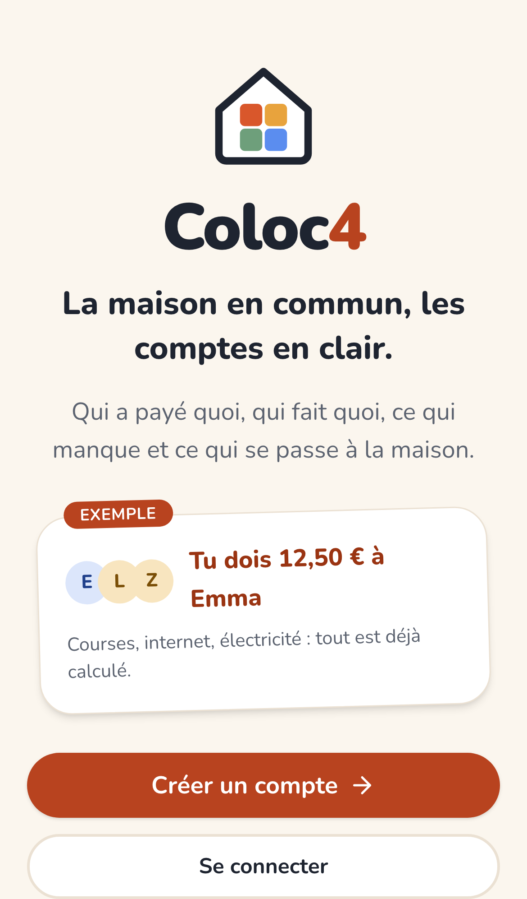
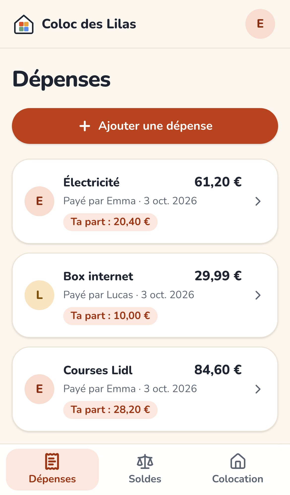
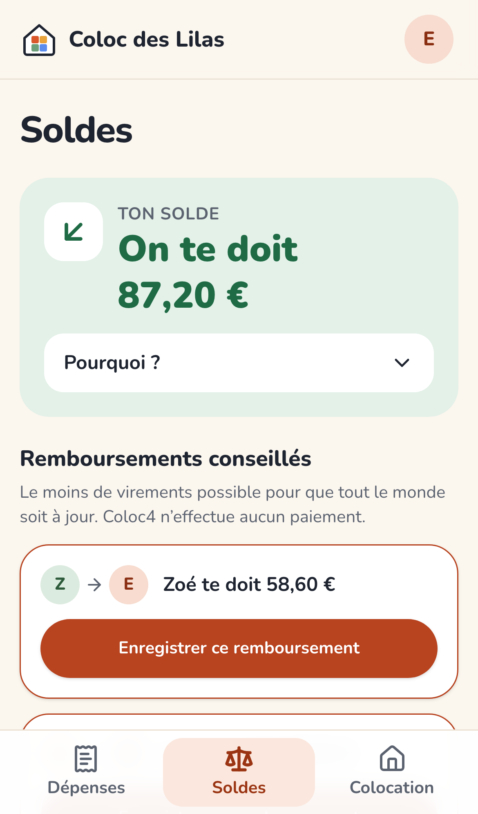
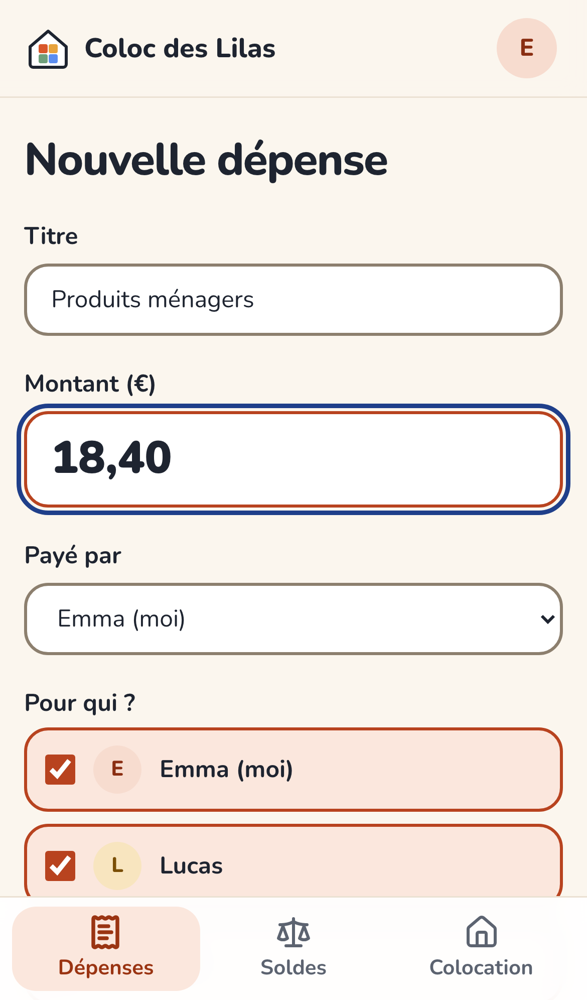
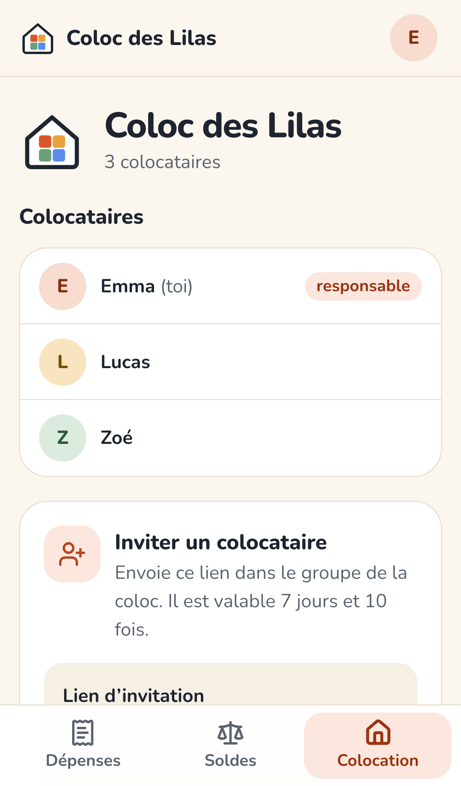
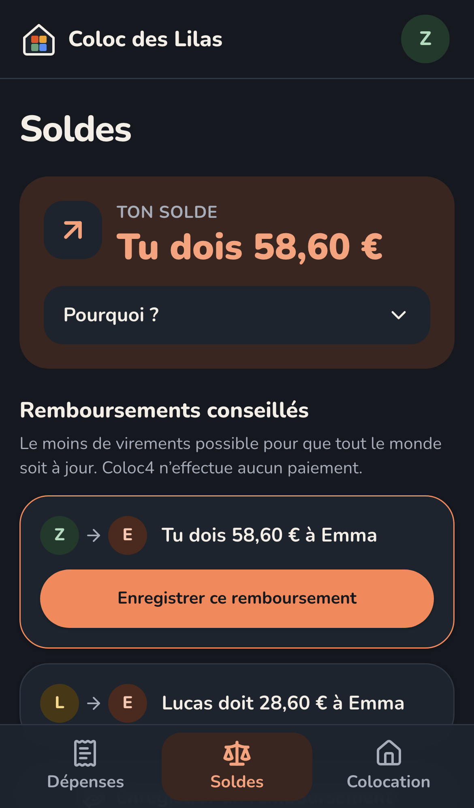

<div align="center">


# Coloc4

### La maison en commun, les comptes en clair.

**Qui a payé quoi, qui doit combien à qui, et pourquoi.**
Une appli web pour la colocation, pensée pour le téléphone, en français, sans prise de tête.

[**Voir l'appli en ligne →**](https://coloc4.vercel.app)

<sub>Version de test · Next.js · Supabase · TypeScript · Licence Apache 2.0</sub>

<br />


&nbsp;

&nbsp;


</div>

---

## Pourquoi Coloc4 ?

En colocation, les questions reviennent toujours : *« C'est qui qui a payé internet ? »*, *« Je te dois combien ? »*, *« On est quittes ? »*. Les réponses sont éparpillées entre le groupe WhatsApp, des virements et la mémoire de chacun.

Coloc4 rassemble l'essentiel au même endroit :

- 🧾 **Une dépense en moins de 30 secondes** : titre, montant, c'est tout. Le payeur, les participants et la répartition égale sont déjà remplis.
- 🗣️ **Un solde en une phrase** : « Tu dois 12,50 € à Emma », jamais « solde débiteur : −12,50 ».
- 🔍 **Un bouton « Pourquoi ? »** qui détaille chaque dépense derrière ton solde, centime par centime. La confiance passe par l'explication.
- 🔁 **Le moins de virements possible** pour que tout le monde soit quitte, avec un clic pour enregistrer un remboursement déjà fait.
- 🚪 **On peut partir, revenir, ou supprimer son compte** sans fausser les comptes des autres.

> **Coloc4 ne touche jamais à ton argent.** L'appli calcule ; vous vous remboursez comme d'habitude (virement, espèces…) et vous le notez ici.

## En images

<div align="center">


&nbsp;

&nbsp;


<sub>Saisie rapide · Invitation par lien · Mode sombre automatique</sub>

</div>

## Ce que l'appli sait faire aujourd'hui

| | |
|---|---|
| **Comptes** | Inscription avec confirmation par email, mot de passe oublié, profil avec prénom ou surnom |
| **Colocations** | Création, invitation par lien (7 jours, 10 utilisations, révocable), départ, retour, transfert du rôle de responsable, archivage |
| **Dépenses** | Répartition égale ou montants exacts, modification, suppression, historique |
| **Soldes** | Solde personnel expliqué, remboursements conseillés, remboursements enregistrés (annulables) |
| **Anciens colocataires** | Ils restent visibles tant que leur solde n'est pas réglé ; ils ne peuvent plus être ajoutés aux nouvelles dépenses |
| **Vie privée** | Suppression de compte : le nom devient « Ancien colocataire N », les montants restent pour que les soldes des autres restent justes |
| **Pour tout le monde** | Français, pensé pour le mobile, mode clair/sombre, boutons larges, contrastes vérifiés (WCAG AA), installable sur l'écran d'accueil |

**Prochaines étapes :** un essai réel de deux semaines avec quatre colocataires, puis les tâches ménagères, la liste de courses et l'agenda partagé. Ce qui sera construit dépendra de ce que l'essai montrera.

## Sous le capot

Le plus délicat dans une appli de comptes, c'est que **les chiffres soient justes, tout le temps**. Les choix techniques en découlent :

- **Pas de virgule flottante.** Les montants sont des entiers en centimes (`bigint`) de la base de données jusqu'à l'écran. `0,1 + 0,2` ne produit jamais `0,30000000000000004`.
- **Partage déterministe.** 10,00 € à trois = 3,34 + 3,33 + 3,33, avec la même règle côté TypeScript et côté SQL, vérifiée par des tests croisés sur des centaines de cas aléatoires.
- **La somme des soldes vaut toujours zéro.** C'est un invariant testé par propriétés, vérifié en base à chaque enregistrement, et surveillé à l'affichage : si un écart apparaissait, l'appli refuserait d'afficher des chiffres faux.
- **Les soldes sont calculés, pas stockés.** L'historique est la seule source de vérité ; aucun compteur ne peut dériver.
- **L'identité n'est pas le compte.** Un colocataire est une entité de l'historique, distincte de son compte de connexion : supprimer un compte ne casse jamais les comptes des autres.
- **La sécurité est dans la base.** Chaque table est protégée par des règles de sécurité au niveau des lignes (RLS) ; les écritures passent par des fonctions SQL transactionnelles. Une colocation ne peut pas lire les données d'une autre, même si le code de l'appli avait un bug.
- **Les invitations sont atomiques.** Deux personnes qui utilisent en même temps la dernière place d'un lien : une seule entre, testé avec de vraies connexions concurrentes.

### Technologies

Next.js 16 (App Router) · React 19 · TypeScript strict · Tailwind CSS 4 · Supabase (PostgreSQL, Auth) · Vitest + fast-check · Playwright + axe · pgTAP · GitHub Actions · Vercel

### Tests

Près de 350 tests automatiques, exécutés à chaque modification :

| Famille | Ce qu'elle protège |
|---|---|
| Unitaires et propriétés | Calculs d'argent, partages, soldes, remboursements |
| Base de données (pgTAP) | Sécurité RLS, contraintes, fonctions SQL, cycle de vie des membres |
| Intégration | Concurrence des invitations, équivalence TypeScript ↔ SQL |
| Bout en bout (Playwright) | Parcours complets sur mobile, emails réels, accessibilité automatique |

Les garde-fous les plus importants ont été vérifiés en les cassant volontairement : le test doit alors échouer.

## Lancer le projet chez soi

Prérequis : Node.js 24+ et Docker.

```bash
npm ci
npm run db:start               # base Supabase locale (ports 544xx)
cp .env.example .env.local     # puis y coller l'URL et la clé publique affichées par `npx supabase status`
npm run dev                    # http://localhost:3000
```

| Commande | Rôle |
|---|---|
| `npm run typecheck` · `npm run lint` | Vérifications statiques |
| `npm test` | Tests unitaires et propriétés |
| `npm run db:test` | Tests de la base (pgTAP) |
| `npm run test:integration` | Concurrence et équivalence SQL/TypeScript |
| `npm run test:e2e` | Parcours complets sur mobile |

Seules deux variables publiques sont nécessaires (`NEXT_PUBLIC_SUPABASE_URL` et la clé publique) : **aucune clé secrète n'est utilisée par l'application.**

## Pour aller plus loin

- 📐 [Conception complète](docs/phase-0-design.md) : décisions d'architecture, modèle de données, sécurité
- 🎨 [Identité visuelle](docs/identite-visuelle.md) : logo, couleurs, composants
- ✅ [Preuves de test](docs/m1-test-evidence.md) : ce qui est testé, comment, et ce que l'automatisation ne couvre pas
- 🚀 [Mise en production et essai à 4](docs/deployment.md)

## Ce que Coloc4 n'est pas

Ni une banque, ni un outil de paiement, ni un réseau social, ni un gestionnaire immobilier. Coloc4 complète le groupe WhatsApp de la coloc ; il ne cherche pas à le remplacer.

## Données et confidentialité

L'appli ne demande que l'email, un prénom ou surnom et les dépenses saisies : pas d'adresse, pas de coordonnées bancaires. Le détail, en clair, est sur la page [Données et confidentialité](https://coloc4.vercel.app/donnees) de l'appli. Il s'agit d'une description factuelle d'une version de test, pas d'une attestation de conformité juridique.

## Licence

Copyright © 2026 Euloge Mabiala Junior — [Apache 2.0](LICENSE).
